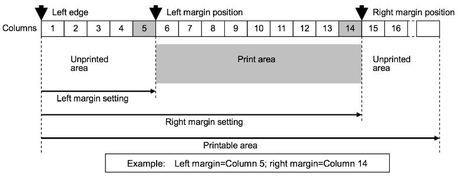

# QL720NW

This is a driver library for the Brother Label Printer. The printer’s data sheet can be found [here](./cv_ql720_eng_escp_100.pdf). This library exposes basic text and barcode print functionality. It does not implement all of the functionality of the printer as outlined in the data sheet. Please submit pull requests for features that you would like to be added.  

**To use this library, add the following statement to the top of your device code:**

```squirrel
#require "QL720NW.device.lib.nut:1.0.0"
```

[](https://travis-ci.org/electricimp/QL720NW)

## Class Usage

All public methods in the *QL720NW* class return `this`, allowing you to easily chain multiple commands together:

```squirrel
printer
    .setOrientation(QL720NW_LANDSCAPE)
    .setFont(QL720NW_FONT_SAN_DIEGO)
    .setFontSize(QL720NW_FONT_SIZE_48)
    .write("San Diego 48")
    .print();
```

### Constructor: QL720NW(*uart[, init]*)

The *QL720NW* constructor takes one required parameter: a pre-configured imp UART object. You can also supply a boolean parameter, *init*, but this is optional. By default *init* is set to `true` and this causes the constructor to call the *initialize()* method, which will run the setup commands to put the printer in ESC/P standard mode and set up the printer’s defaults.

```squirrel
uart <- hardware.uart12;
uart.configure(9600, 8, PARITY_NONE, 1, NO_CTSRTS, function() {
    server.log(uart.readstring());
});

printer <- QL720NW(uart);
```

## Class Methods

### initialize()

The *initialize()* method runs the setup commands to put the printer in ESC/P standard mode and initialize its defaults.

```squirrel
printer.initialize();
```

### setOrientation(*orientation*)

The *setOrientation()* method sets the orientation of the printed text. It takes one required parameter, *orientation*, which should be either of the constants *QL720NW_LANDSCAPE* or *QL720NW_PORTRAIT*.

**Note** The parameter set by *setOrientation()* is written to UART when the method is called, and so will take effect immediately and affect everything stored in the print buffer.

```squirrel
// Set to landscape mode
printer.setOrientation(QL720NW_LANDSCAPE);
```

```squirrel
// Set to portrait mode
printer.setOrientation(QL720NW_PORTRAIT);
```

### setRightMargin(*column*)

The *setRightMargin()* method sets the right margin. It takes one required parameter, *column*, which is an integer. The position of the right margin is the character width times *column* from the left edge. See the ‘Margin Notes’ diagram, below, for more details.

**Note** The parameter set by *setRightMargin()* is written to UART when the method is called, and so will take effect immediately and affect everything stored in the print buffer.

### setLeftMargin(*column*)

The *setLeftMargin()* method sets the left margin. It takes one required parameter, *column*, which is an integer. The position of the left margin is the character width times *column* from the left edge. See the ‘Margin Notes’ diagram, below, for more details.

**Note** The parameter set by *setLeftMargin()* is written to UART when the method is called, and so will take effect immediately and affect everything stored in the print buffer.

#### Margin Notes



Cases when margin settings are ignored include:

- The left margin is to the right of the right margin.
- The difference between the right and left margins is less than one character.
- The print medium is continuous length tape with no page length specified and the print orientation is landscape.

```squirrel
// Print 'Hello' and 'world' on different lines using margin settings
printer
  .setOrientation(QL720NW_PORTRAIT);
  .setFont(QL720NW_FONT_BROUGHAM)
  .setFontSize(QL720NW_FONT_SIZE_32)
  .write("Hello world")
  .setLeftMargin(5)
  .setRightMargin(11)
  .print();
```

### setFont(*font*)

The *setFont()* method sets the font using the *font* parameter. The table below lists the supported font name constants. Brougham is the default font.

| Font Constant |
| --- |
| *QL720NW_FONT_BROUGHAM* |
| *QL720NW_FONT_LETTER_GOTHIC_BOLD* |
| *QL720NW_FONT_BRUSSELS* |
| *QL720NW_FONT_HELSINKI* |
| *QL720NW_FONT_SAN_DIEGO* |

**Note** *setFont()* settings only effect text entered *after* the method is called. Font settings are often cleared after *pageFeed()* or *print()* are called, so it is best to set the font for each label.

```squirrel
// Set font to Helsinki
printer.setFont(QL720NW_FONT_HELSINKI);
```

### setFontSize(*size*)

The *setFontSize()* method sets the font size (in points) using the *size* parameter. The default font size is 32. Currently the only supported *size* values are the following constants:

| Size Constant          |
| ---------------------- |
| *QL720NW_FONT_SIZE_24* |
| *QL720NW_FONT_SIZE_32* |
| *QL720NW_FONT_SIZE_48* |

**Note** *setFontSize()* settings only effect text entered *after* the method is called. Font settings are often cleared after *pageFeed()* or *print()* are called, so it is best to set the font size for each label.

```squirrel
// Set font size to 48
printer.setFontSize(QL720NW_FONT_SIZE_48);
```

### write(*text[, options]*)

The *write()* method sets the text to be printed. It takes one required parameter, *text*, which is a string containing the text to be printed. It also has one optional parameter, *options*. By default no options are set. Options are selected by OR-ing the class constants *QL720NW_ITALIC*, *QL720NW_BOLD* and *QL720NW_UNDERLINE*.

**Note** This method only stores the text to be printed in a buffer. To print you must also call the *print()* method, as the example below shows.

```squirrel
// Print an underlined and italicized line of text
printer.setFont(QL720NW_FONT_SAN_DIEGO)
       .setFontSize(QL720NW_FONT_SIZE_48)
       .write("Hello World", QL720NW_UNDERLINE | QL720NW_ITALIC )
       .print();
```

### writen(*text[, options]*)

The *writen()* method sets a line of text to be printed: it automatically prints a New Line character. This method takes one required parameter, *text*, which is a string containing the text to be printed. It also has one optional parameter, *options*. By default no options are set. Options are selected by OR-ing the class constants *QL720NW_ITALIC*, *QL720NW_BOLD* and *QL720NW_UNDERLINE*.

**Note** This method only stores the text to be printed in a buffer. To print you must also call the *print()* method, as the example below shows.

```squirrel
// Print an italicized line of text then an underlined line of text
printer.setFont(QL720NW_FONT_SAN_DIEGO)
       .setFontSize(QL720NW_FONT_SIZE_48)
       .writen("Hello World", QL720NW_BOLD | QL720NW_ITALIC )
       .write("I'm Alive!", QL720NW_UNDERLINE )
       .print();
```

### newline()

The *newline()* method adds a New Line character to the print buffer.

```squirrel
// Print two lines of text
printer.setFont(QL720NW_FONT_SAN_DIEGO)
       .setFontSize(QL720NW_FONT_SIZE_48)
       .write("Hello World")
       .newline()
       .write("I'm Alive!")
       .print();
```

### pageFeed()

The *pageFeed()* method adds a page feed character to the print buffer. Please note after a page feed, font name and font size settings are often reset to defaults.

```squirrel
// Print two labels in one print job
printer.setFont(QL720NW_FONT_SAN_DIEGO)
       .setFontSize(QL720NW_FONT_SIZE_48)
       .write("Hello World")
       .pageFeed()
       .write("I'm Alive!")
       .print();
```

### writeBarcode(*data[, config]*)

The *writeBarcode()* method specifies a barcode to be printed. It has one required parameter, *data*, which is an integer or string value. It also has one optional parameter, *config*, which takes a table of configuration parameters.

#### Configuration Table

| Config Table Key     | Value Data type         | Default Value             | Description     |
| -------------------- | ----------------------- | ------------------------- | --------------- |
| *type*               | Barcode Type Constant   | QL720NW_BARCODE_CODE39    | Type of barcode to print. See table below |
| *charsBelowBarcode*  | Boolean                 | `true `                   | Whether to print data below the barcode |
| *width*              | Barcode Width Constant  | QL720NW_BARCODE_WIDTH_XS  | Width of barcode. See table below |
| *height*             | Float                   | 0.5                       | Height of barcode in inches |
| *ratio*              | Barcode Ratio Constants | QL720NW_BARCODE_RATIO_2_1 | Ratio between thick and thin bars. Setting available only for type *QL720NW_BARCODE_CODE39*, *QL720NW_BARCODE_ITF* or *QL720NW_BARCODE_CODABAR*. See table below |

#### Barcode Type

| Barcode Type Constant           | Data Length                                           |
| ------------------------------- | ----------------------------------------------------- |
| *QL720NW_BARCODE_CODE39*        | 1-50 characters ("*" is not included)                 |
| *QL720NW_BARCODE_ITF*           | 1-64 characters                                       |
| *QL720NW_BARCODE_EAN_8_13*      | 7 characters (EAN-8), 12 characters (EAN-13)          |
| *QL720NW_BARCODE_UPC_A*         | 11 characters                                         |
| *QL720NW_BARCODE_UPC_E*         | 6 characters                                          |
| *QL720NW_BARCODE_CODABAR*       | 3-64 characters (Must begin and end with A, B, C, D)  |
| *QL720NW_BARCODE_CODE128*       | 1-64 characters                                       |
| *QL720NW_BARCODE_GS1_128*       | 1-64 characters                                       |
| *QL720NW_BARCODE_RSS*           | 3-15 characters (begins with "01")                    |
| *QL720NW_BARCODE_CODE93*        | 1-64 characters                                       |
| *QL720NW_BARCODE_POSTNET*       | 5 characters, 9  characters,11 characters             |
| *QL720NW_BARCODE_UPC_EXTENTION* | 2 characters, 5 characters                            |

#### Barcode Width

| Barcode Width Constant      |
| --------------------------- |
| *QL720NW_BARCODE_WIDTH_XXS* |
| *QL720NW_BARCODE_WIDTH_XS*  |
| *QL720NW_BARCODE_WIDTH_S*   |
| *QL720NW_BARCODE_WIDTH_M*   |
| *QL720NW_BARCODE_WIDTH_L*   |

#### Barcode Ratio

| Barcode Ratio Constant       |
| ---------------------------- |
| *QL720NW_BARCODE_RATIO_2_1*  |
| *QL720NW_BARCODE_RATIO_25_1* |
| *QL720NW_BARCODE_RATIO_3_1*  |

**Note** This method only stores the text to be printed in a buffer. To print you must also call the *print()* method.

```squirrel
// Print the device's MAC address as a barcode
barcodeConfig <- {"type" : QL720NW_BARCODE_CODE39,
                  "charsBelowBarcode" : true,
                  "width" : QL720NW_BARCODE_WIDTH_M,
                  "height" : 1,
                  "ratio" : QL720NW_BARCODE_RATIO_3_1 }

printer.writeBarcode(imp.getmacaddress(), barcodeConfig)
       .print();
```

### write2dBarcode(*data, type[, config]*)

The *write2dBarcode()* method creates a 2D barcode. This method takes two required parameters: a string or integer *data*, wich contains the data to be printed as a barcode, and *type*, the type of barcode to be printed. This method also takes one optional parameter, *config*, which takes a table of configuration parameters. Which configuration parameters are available depends on which type of 2D barcode you select &mdash; both sets are listed in the tables below.

The supported 2D types are QR, selected by passing in the constant *QL720NW_BARCODE_2D_QR*, and Data Matrix, selected by passing in the constant *QL720NW_BARCODE_2D_DATAMATRIX*. 

#### QR Configuration Table

| Config Table Key                | Value Data type            | Default Value                                     | Description     |
| ------------------------------- | -------------------------- | ------------------------------------------------- | --------------- |
| *cell_size*                     | Integer                    | 3                                                 | Specifies the dot size per cell side. Supported values are 3, 4, 5, 6, 8, 10 |
| *symbol_type*                   | Symbol Type Constant       | QL720NW_BARCODE_2D_QR_SYMBOL_MODEL_2              | Symbol type to be used. See table below |
| *structured_append_partitioned* | Boolean                    | `false`                                           | Whether the structured append is partitioned |
| *code_number*                   | Integer                    | 0                                                 | Indicates the number of the symbol in a partitioned QR Code. Must set a number between 1-16 if *structured_append_partitioned* is set to `true` |
| *num_partitions*                | Integer                    | 0                                                 | Indicates the total number of symbols in a partitioned QR Code. Must set a number between 2-16 if *structured_append_partitioned* is set to `true` |
| *parity_data*                   | hexadecimal                | 0                                                 | Value in bytes of exclusively OR-ing all the print data (print data before partition) |
| *error_correction*              | Error Correction Constant  | *QL720NW_BARCODE_2D_QR_ERROR_CORRECTION_STANDARD* | See table below |
| *data_input_method*             | Data Input Method Constant | *QL720NW_BARCODE_2D_QR_DATA_INPUT_AUTO*           | Auto: *QL720NW_BARCODE_2D_QR_DATA_INPUT_AUTO*,<br>Manual: *QL720NW_BARCODE_2D_QR_DATA_INPUT_MANUAL* |

#### QR Symbol Type

| Symbol Type Constant                    |
| --------------------------------------- |
| *QL720NW_BARCODE_2D_QR_SYMBOL_MODEL_1*  |
| *QL720NW_BARCODE_2D_QR_SYMBOL_MODEL_2*  |
| *QL720NW_BARCODE_2D_QR_SYMBOL_MICRO_QR* |

#### QR Error Correction

| Error Correction Constant                                       | Level                               |
| --------------------------------------------------------------- | ----------------------------------- |
| *QL720NW_BARCODE_2D_QR_ERROR_CORRECTION_HIGH_DENSITY*           | High-density level: L 7%            |
| *QL720NW_BARCODE_2D_QR_ERROR_CORRECTION_STANDARD*               | Standard level: M 15%               |
| *QL720NW_BARCODE_2D_QR_ERROR_CORRECTION_HIGH_RELIABILITY*       | High-reliability level: Q 25%       |
| *QL720NW_BARCODE_2D_QR_ERROR_CORRECTION_ULTRA_HIGH_RELIABILITY* | Ultra-high-reliability level: H 30% |

#### Data Matrix Configuration Table

| Config Table Key  | Value Data Type       | Default Value                       | Description     |
| ----------------- | --------------------- | ----------------------------------- | --------------- |
| *cell_size*       | integer               | 3                                   | Specifies the dot size per cell side. Supported values are 3, 4, 5, 6, 8, 10 |
| *symbol_type*     | Symbol Type Constant  | QL720NW_BARCODE_2D_DM_SYMBOL_SQUARE | Symbol type to be used. Square: QL720NW_BARCODE_2D_DM_SYMBOL_SQUARE, Rectangular: QL720NW_BARCODE_2D_DM_SYMBOL_RECTANGLE |
| *vertical_size*   | integer               | 0                                   | Specifies the vertical number of cells. Supported vaules for square type are 0 (Auto), 10, 12, 14, 16, 18, 20, 22, 24, 26, 32, 36, 40, 44, 48, 52, 64, 72, 80, 88, 96, 104, 120, 132, 144. Supported vaules for rectangular type are 0 (Auto), 8, 12, 16 |
| *horizontal_size* | integer               | 0                                   | Specifies the horizontal number of cells. If square type is selected horizontal size with be set to match the vertical size. The horizontal_size is only supported in conjunction with specific vertical_sizes. See table below for supported rectangular horizontal cell sizes. |

#### Data Matrix Rectangular Horizontal Size

| Horizontal Cell Size | Data Type | Supported Vertical Cell Size |
| -------------------- | --------- | ---------------------------- |
| *0*                  | integer   | Auto                         |
| *18*                 | integer   | 8 cells                      |
| *32*                 | integer   | 8 cells                      |
| *26*                 | integer   | 12 cells                     |
| *36*                 | integer   | 12 cells or 16 cells         |
| *48*                 | integer   | 16 cells                     |

**Note** This method only stores the text to be printed in a buffer. To print you must also call the *print()* method.

```squirrel
mac <- imp.getmacaddress();
qrSettings <- { "cell_size": 5 };
dataMatrixSettings <- { "cell_size" : 8 };

// write QR barcode
printer.write2dBarcode(mac, QL720NW_BARCODE_2D_QR, qrSettings);

// write dataMatrix barcode
printer.write2dBarcode(mac, QL720NW_BARCODE_2D_DATAMATRIX, dataMatrixSettings);

// print barcodes
printer.print();
```

### print()

The *print()* method outputs the contents of the print buffer as set by the *write()*, *writen()*, *writeBarcode()* and/or *write2dBarcode()* methods.

```squirrel
// Print a line of text
printer.write("Hello World")
       .print();
```

## To Do

- Issue: Printer appears to drop UART commands while printing. Workaround: add a pause after calling *print()*.
- Issue: Printer is inconsistent when setting font and font size between print jobs. Workaround: always set font and font size for each label printed.
- Not all features have been implemented.

## License

The QL720NW class is licensed under the [MIT License](./LICENSE).
